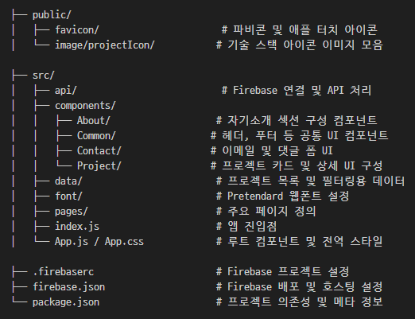
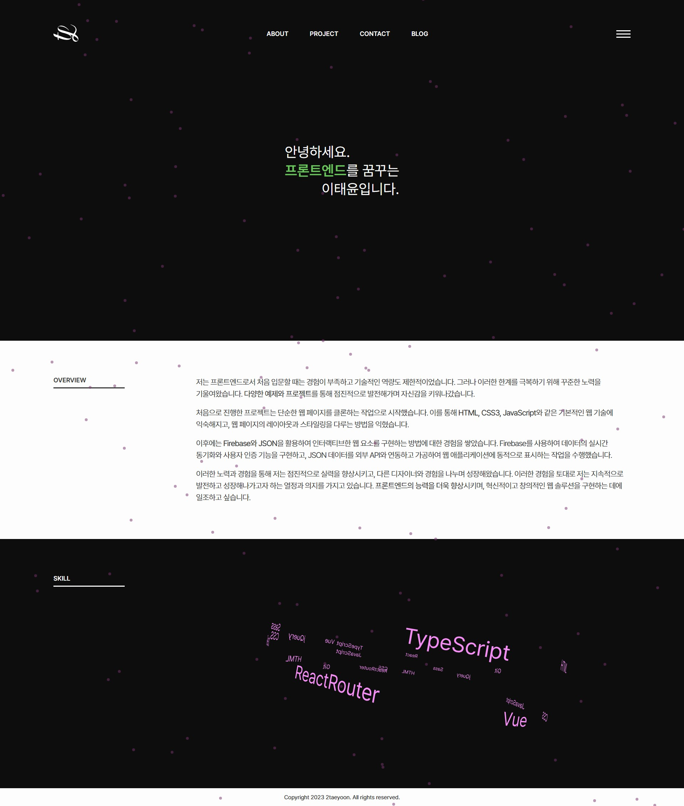
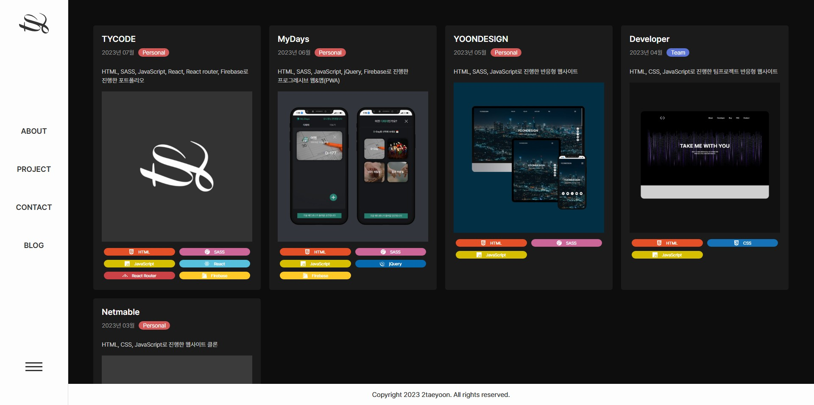
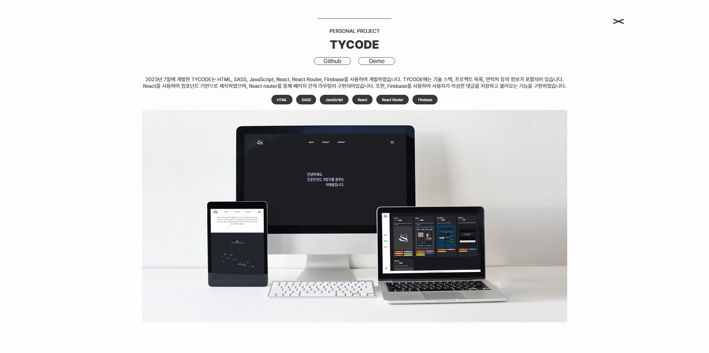
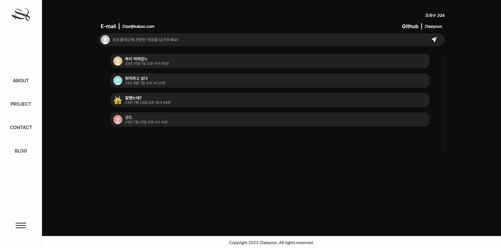
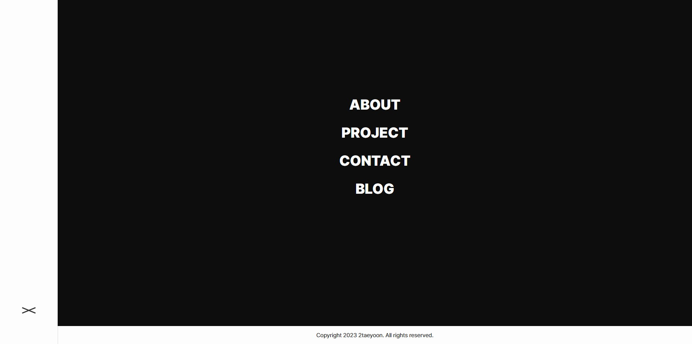

# TYCODE - React 기반 포트폴리오 웹사이트

TYCODE는 React를 기반으로 한 SPA 포트폴리오 웹사이트입니다.  
**자기소개, 프로젝트 목록, 스킬 아이콘, 코멘트/이메일 폼** 등으로 구성되어 있으며, 다양한 애니메이션과 키프레임 효과를 활용하여 인터랙티브하고 감각적인 UI를 구현했습니다.

---

## 📌 주요 기능 및 구현

### 💡 공통 기능
- **React SPA 구성**: 라우팅 없이 부드럽게 동작하는 싱글 페이지 앱
- **자기소개 영역**: 키워드 등장 애니메이션, 스킬 아이콘 전시
- **프로젝트 상세 UI**: 프로젝트별 기술 스택, 설명, 링크(깃허브/사이트)
- **이메일 전송**: 이메일 입력 + 코멘트 폼을 통한 전송 기능
- **댓글 저장/조회**: Firestore를 통한 간단한 댓글 시스템
- **404 페이지 구성**: 유저 이탈 방지를 위한 에러 페이지 제공

---

## 📂 폴더 및 파일 구조

---

## 🛠 사용 기술 스택

- **React 18+ (CRA 기반)**
- **SCSS Modules**: 컴포넌트 단위 스타일링
- **Firebase (Firestore + Hosting)**: 댓글 저장 및 배포
- **Vanilla JavaScript**: 인터랙션 및 스크롤 애니메이션
- **Custom Keyframe Animations**: 등장, 회전, 페이드인 등
- **React Router** (404 페이지 라우팅)
- **Pretendard 웹폰트 사용**

---

## ✅ 구현 포인트

- **About 페이지 키프레임 애니메이션**  
  텍스트와 도형을 활용한 연속적인 등장 효과

- **프로젝트 소개 UI/UX**  
  기술 아이콘, 배경 효과, 상세 설명 + 외부 링크

- **Contact 페이지**  
  코멘트 + 이메일을 입력하면 Firestore에 저장되는 폼

- **모듈화된 구조**  
  Header, Footer, SkillIcon 등 컴포넌트 단위로 관리

- **404 에러 페이지**  
  예외 상황 대응을 위한 사용자 친화적 페이지 구성

---

## 📎참고

- 본 프로젝트는 실사용 목적이 아닌 **포트폴리오 용도로 제작된 개인 프로젝트**입니다.
- Firebase로 배포되어 있으며, 코드 구조와 디자인 모두 직접 설계하였습니다.

---

## 📷 미리보기

